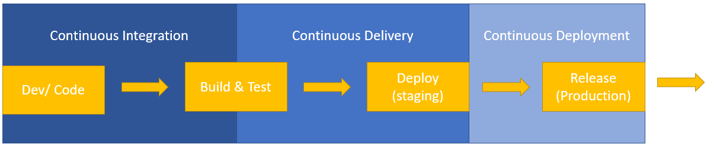

# Continuous Integration and Continuous Delivery (CI/CD) Understanding

Author: Jitian Liang 
Date: 29/12/2022 
Description: Response to 2023 UTS IT Operations Internships technical challenge 

---

## Q1.In business or technical terms describe your understanding of continuous integration and continuous delivery (CI/CD)?

In my opinion, CI/CD (Continuous Integration, Continuous Delivery and Continuous Deployment) is an automattion pipeline in the Software Development Life Cycle (SDLC) for deliverying the software to end users. Below graph shows a high level overview of the mapping of CI/CD and the SDLC phases:  
 

CI process starts at the Development/ Coding phase and extends to the Test phase. It includes the process of developers push the code to a **shared code repository** frequently. And each pushed code triggers the automated workflow of automated tests and builds in the **CI server/ tools** to check the code for bugs and provide feedback to developers. 
CD(**Continuous Delivery**) starts right after CI if all CI tests are passed and extends to the end of Deployment (staging) phase. The software is deployed on a **production like environment** and running automation tests to ensure the build is ready for release. It may involve a manual step to "approve" a deployment.  
CD(**Continuous Deployment**): includes the fully automated deployment to production (Release phase) if all Continuous Delivery tests are passed, no manual intervetion of approvals to deployment to production environment which means every change that passes through all automation tests is deployed to production. 
In conclusion, CI packages and tests software builds and alerts developers if their changes fail any unit tests. CD is the automation that delivers applications, services, and deployments to the runtime infrastructure and may execute additional tests. 

Extra bit on Security: 
Security considerations and practices were often introduced late in the SDLC. However, with the rise of more sophisticated cybersecurity attacks, and development teams shifting to shorter, more frequent iterations on applications, DevSecOps is now becoming a go-to practice for development teams. Where DevSecOps infuses security into the CI/CD pipeline and enables delivering robust and secure applications more efficiently. (Detail in below sources links)

## Q2. What are some tools that are used for this and why are they used.

Below are the tools corresponding to the bolded areas in Q1: 
| Purpose/ Stage | Tools |
| -------------------------------------|-----------------------------------------------------|
| **CI server/ tools** | AWS CodeBuild/ Jenkins CI/ etc... |
| **Continuous Delivery & Deployment** | AWS CodeDeploy/ AWS Elastic Beanstalk / AWS CodeDeploy/ Jenkins CD/ Spinnaker, etc...|
| **shared code repository** | SCMs like AWS CodeCommit/ GitHub/ Bitbucket/ etc... |
| **production like environment** | Container services like docker/ podman/ etc... |
Note：

1. AWS CodePipeline is a comprehensive product for CI/CD to orchestrate everything.
2. Some other Devops tools: GitHub Actions, Kubernetes, CircleCI, Azure DevOps, Atlassian Bamboo, Argo CD, Buddy, Drone, Travis CI.

The reason these tools are used is because they enables the CI/CD pipeline by: 

1. Automate develope's workflow
2. Find & fix bugs early, fix bugs
3. Deliver faster as the code is tested automatically
4. Less tedious repetitive work for developers
5. Avoid "Merge Hell"
6. Ensure the software can be released reliably whenever needed

---

Approach Steps & Resource Links:

1. Youtube Vedio for a basic understanding/ intro: 
   [What is CICD](https://www.youtube.com/watch?v=N9KbmHhesmE) 
   [DevOps CI/CD Explained in 100 Seconds](https://www.youtube.com/watch?v=scEDHsr3APg) 
   [School Of Basics | What is CI CD | What is CI CD Pipeline](https://www.youtube.com/watch?v=k2aNsQKwyOo)

2. Further reading: 
   [What is CI/CD? Continuous integration and continuous delivery explained](https://www.infoworld.com/article/3271126/what-is-cicd-continuous-integration-and-continuous-delivery-explained.html) 
   [5 best practices for securing CI/CD pipelines](https://www.infoworld.com/article/3673891/5-best-practices-for-securing-cicd-pipelines.html) 
   [What is DevSecOps?](https://www.vmware.com/topics/glossary/content/devsecops.html)

3. Explore GitHub Action: 
   [GitHub Actions Tutorial](https://www.youtube.com/watch?v=R8_veQiYBjI)
